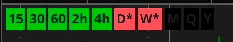

# The Strat - FTFC (Full Time Frame Continuity) Labels

> Simple FTFC confirmation at a glance.

[👀 View the code](./code.tosts)

[🔗 Import into TOS](http://tos.mx/0HHWqmZ)

## Features

-   Zero-config! It just works. Install and go!
-   Up and down colors automatically match your chart setting up and down colors.
-   Highly performant; only running calculations when absolutely necessary.
-   Includes 1 minute, 5 minute, 15 minute, 30 minute, 60 minute / 1 hour, 2 hour, 4 hour, day, week, month, quarter, and year time frames.
-   A simple `*` indicator to denote a time frame is an inside bar.

## Changelog

### 02/06/2022

-   Initial release.

## FAQ

What is FTFC (Full Time Frame Continuity)?

FTFC is a principle / concept of [#TheStrat](https://twitter.com/search?q=%23TheStrat). If you've never heard of it before, start with the following article.

[What Do We Know to Be True About Price Action?](https://www.newtraderu.com/2019/02/13/what-do-we-know-to-be-true-about-price-action/)

Why is a time frame box dark?

If you are seeing dark boxes like this:

It's because the time interval isn't supplying enough historical time data to properly calculate continuity. You need to adjust the time interval to give it more data.

## Credit / Inspiration

The [first version](http://tos.mx/TNPBVJ6) I came across was created by [@mm](https://twitter.com/mm). However, it came with a "⚠️ Complex script, you may experience greater load times." warning inside of TOS and it wasn't kidding! It would cause my laptop fans to sound like a jet engines and it sent my laptop temperature to climb to very dangerous levels.

The [next version](https://tos.mx/JZROQzW) I came across was created by [@pelonsax](https://twitter.com/pelonsax). The code was less complex, but it was visually too busy for me and could be even more performant.
